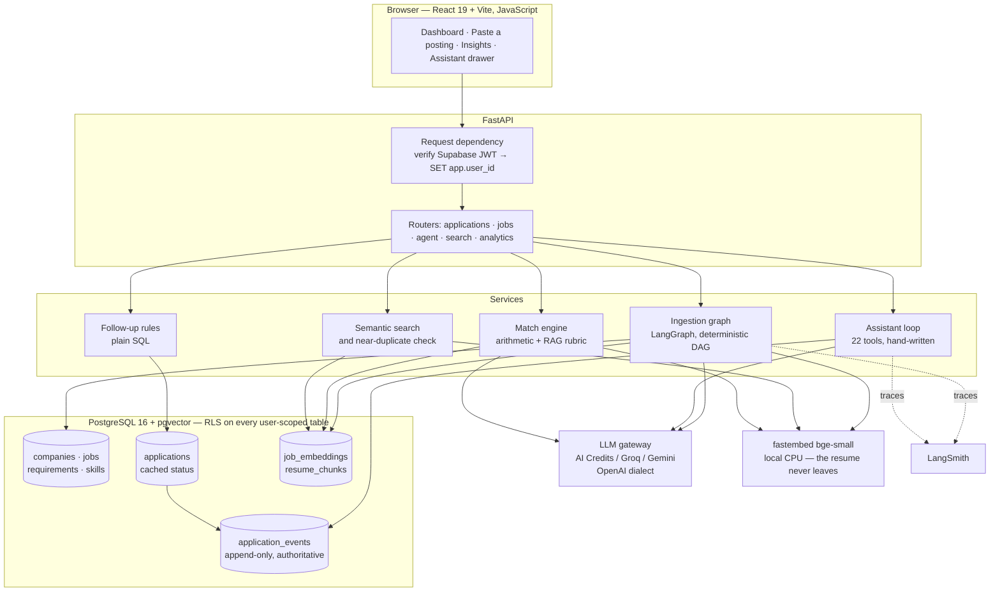
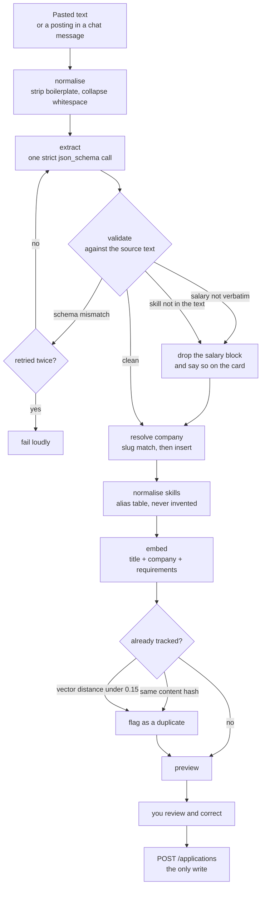
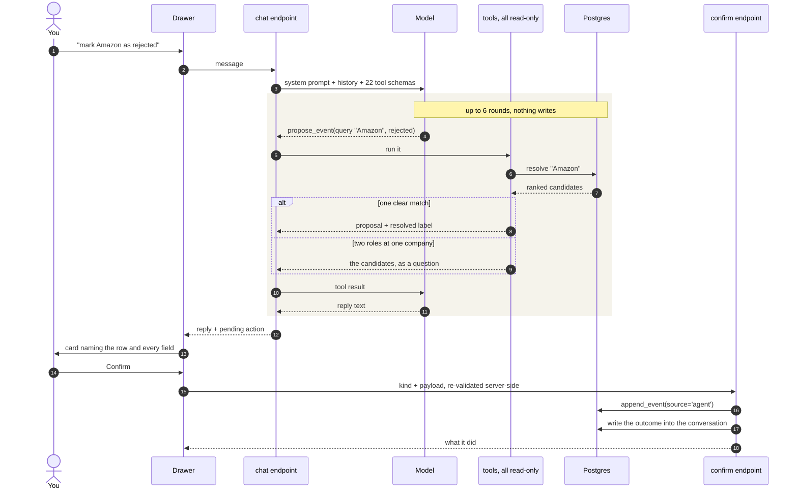
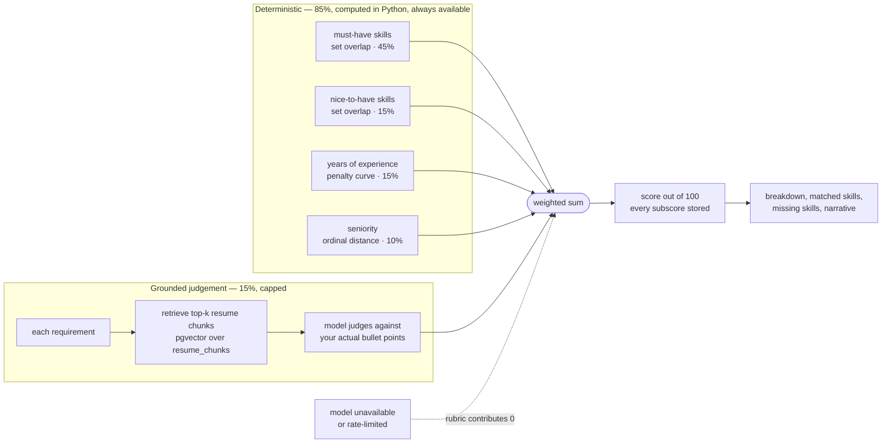
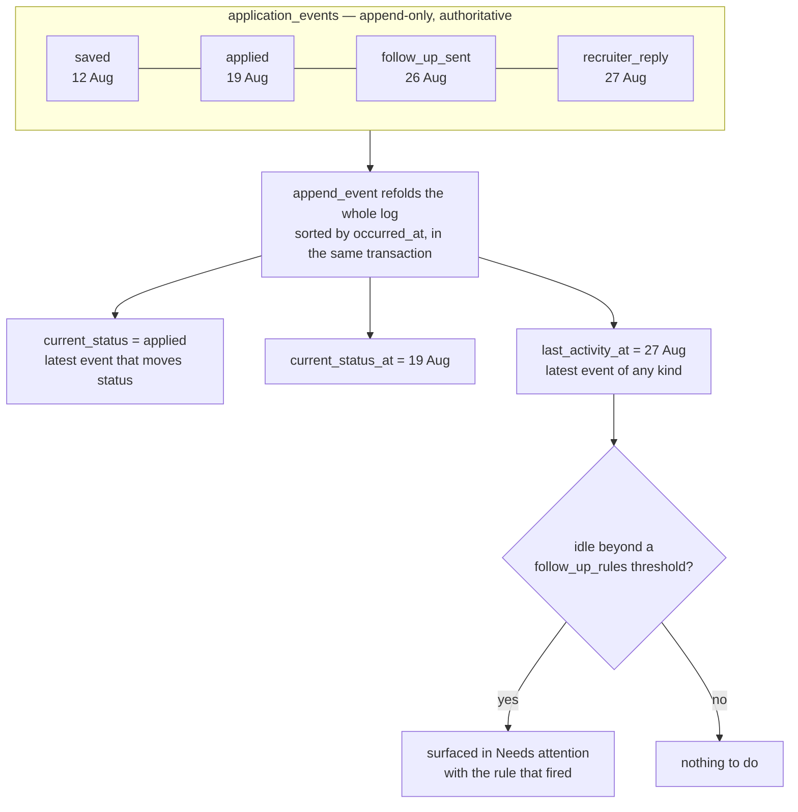

# AI Job Tracker

Replaces a manually-maintained job-application spreadsheet. Paste a job
description; an LLM extracts a structured record, scores it against your resume,
and an event-sourced timeline lets an agent tell you *"Amazon has been silent 7
days since the HR screening — a follow-up is due."*

**Status: Phase 5 complete.** The tracker tells you what has gone quiet, searches
your applications by meaning, and an assistant proposes changes you confirm.
Phase 6 — deployment and the scheduled sweep — is not built.

## How it fits together

Four paths through the same data. A posting comes in by paste or by chat and is
extracted once; everything after that reads what extraction stored.



Three things in that picture are load-bearing and easy to miss.

**`app.user_id` is set before the route runs.** Isolation is enforced by
Postgres, not by remembering a `WHERE` clause — see [Two database
roles](#two-database-roles).

**Embeddings are computed locally.** No chat provider serves them, and the
resume is the one document worth keeping off a third party's servers.

**The event log is the source of truth**; `applications.current_status` is a
cache with exactly one writer.

## Stack

| Layer | Choice |
| --- | --- |
| Frontend | React 19 + Vite (JavaScript) + Tailwind 4 + TanStack Query |
| Backend | FastAPI + SQLAlchemy 2.0 async + Alembic |
| Database | PostgreSQL 16 + pgvector (Supabase in deployment) |
| Auth | Supabase Auth — magic link + Google |
| LLM | AI Credits `openai/gpt-4o-mini`, or Groq, or Gemini — set `LLM_PROVIDER` |
| Embeddings | fastembed + `BAAI/bge-small-en-v1.5`, local — Phase 3 |
| Agent | LangChain (`ChatOpenAI`, one class per provider host) + LangGraph + LangSmith |

Neither Groq nor most chat providers serve embedding models, which is why
embeddings run locally rather than through the same provider.

The LLM is provider-neutral because the budgets differ by orders of magnitude.
Groq is fastest (~2–4s) but its free tier allows 8,000 tokens/minute **and**
200,000 per day; measured against Groq's own billed token count the assistant's
fixed prefix is ~3,320 per round, so a two-round turn costs ~7,200–8,500 and
roughly twenty to twenty-five messages exhaust a day, and the daily cap cannot
be waited out. Gemini caps on requests rather than tokens — roomier, slower. AI Credits is
paid (INR/UPI, ~10% over list) with no token ceiling at all, which is why it is
the default. All three speak the OpenAI dialect, so switching is a key, a base
URL, and a model.

`openai/gpt-4o-mini` was chosen by measurement, not by price list. Four
candidates were scored on a 10-case tool-selection eval against the real 20-tool
schema, and on salary extraction — the field most likely to be wrong and least
likely to be re-read. Cost is relative to the cheapest, on an identical workload:

| Model | Tool selection | Salary | Relative cost |
| --- | --- | --- | --- |
| `openai/gpt-oss-120b` | 9/10 | **wrong** | 1.0× |
| `openai/gpt-4.1-nano` | 6/10 | ok | 2.2× |
| **`openai/gpt-4o-mini`** | **10/10** | **ok** | **3.4×** |
| `openai/gpt-5-nano` | 9/10 | ok | 4.6× |

Two results are worth keeping. `gpt-oss-120b` read "45–60 LPA" as 45 to 60
rupees, reproducibly — the same model id that reads it correctly on Groq, which
is a reminder that a gateway's model name is not a guarantee of what served the
request. And `gpt-5-nano` costs *more* than `gpt-4o-mini` despite a lower
headline price, because reasoning tokens are billed as output: 735 per assistant
turn against 23.

In absolute terms the whole spread is small change at personal-project volume,
so none of it was worth trading a wrong salary for. Prompt caching then halves
the prompt cost again — the system prompt and tool schemas are ~3,320 tokens of
identical prefix on every round, and the variable parts come after it, so the
cacheable span is as long as it can be *within* a turn. Across turns it is not:
history is trimmed newest-first against a rolling budget, so once the window
fills, the message right after the system prompt changes every turn and the
cacheable span collapses back to the system prompt alone. `cache_hit_rate` on
the assistant's debug line is where that shows up.

## Getting started

```bash
cp .env.example .env                       # backend config
cp frontend/.env.example frontend/.env.local   # frontend config

docker compose up -d                       # postgres + api
docker compose exec backend alembic upgrade head

cd frontend && npm install && npm run dev
```

- API: http://localhost:8000 (docs at `/docs`)
- App: http://localhost:5173

Supabase credentials are needed to sign in. Without them the app renders a setup
notice naming the missing variables rather than failing obscurely.

### Backend runs in Docker on purpose

The image pins **Python 3.12**. The Phase 3 embedding stack (`fastembed` →
`onnxruntime`) has no wheels for 3.13/3.14, so a newer local interpreter would
install cleanly today and break at Phase 3. Running in the container keeps
development identical to production.

## Two database roles

This trips people up, so it is worth stating plainly:

| Role | Used by | Attributes |
| --- | --- | --- |
| `jobtracker` | Alembic migrations | superuser, owns the schema |
| `app_user` | the API at runtime | `NOSUPERUSER NOBYPASSRLS` |

Row Level Security is how tenants are isolated. **Superusers bypass RLS
unconditionally** — `FORCE ROW LEVEL SECURITY` covers the table-owner case but
not the superuser case. Running the API as `jobtracker` would make every policy
decorative while every test still passed. Hence the split.

Policies are generated by `backend/app/db/rls.py` rather than hand-written per
table, so the ~15 tables Phase 1 adds cannot drift.

To see it working:

```bash
docker compose exec db psql -U jobtracker -d jobtracker -c "SELECT count(*) FROM users;"   # all rows
docker compose exec db psql -U app_user   -d jobtracker -c "SELECT count(*) FROM users;"   # 0
```

## Commands

```bash
# Backend — all inside the container
docker compose exec backend pytest -q          # same invocation CI uses
docker compose exec backend ruff check . && docker compose exec backend ruff format .
docker compose exec backend mypy app
docker compose exec backend alembic revision --autogenerate -m "message"
docker compose exec backend alembic upgrade head

# Frontend
cd frontend
npm run dev
npm run lint
npm run build
```

The test suite creates and migrates a throwaway `jobtracker_test` database, and
connects as `app_user` so the isolation tests prove something real.

## Layout

```
backend/
  app/
    core/      config, logging, Supabase JWT verification
    db/        engine, RLS-scoped session, policy SQL
    models/    SQLAlchemy models
    schemas/   Pydantic request/response
    api/v1/    routers
    agent/     chat model, LangGraph ingestion DAG, assistant loop and tools
    services/  business logic
  alembic/versions/
  tests/
frontend/
  src/
    auth/        session context and route guard
    components/  shared UI
    lib/         supabase client, API client
    routes/      pages
```

## Phases

| Phase | Scope | State |
| --- | --- | --- |
| 0 | Foundations, auth, RLS, CI | done |
| 1 | Tracker CRUD + event timeline — replaces the sheet | done |
| 2 | LLM ingestion and full JD extraction | done |
| 3 | Resume match and scoring | done |
| 4 | Agent — NL commands and follow-up detection | done |
| 5 | Semantic search, dedup, analytics | done |
| 6 | Vercel + EC2 deployment, daily sweep | next |

Known gaps, deliberately: there is no extraction eval set, so a prompt change is
caught by review rather than by a test; the skill taxonomy has no mobile
entries, so a role asking for Swift is refused; and the follow-up sweep runs on
request rather than on a schedule, which is what Phase 6 adds.

## Extraction refuses to guess

`POST /api/v1/jobs/ingest` takes pasted text and returns a structured preview.
It **writes nothing** — you review and correct, then save. Extraction is good,
not perfect, and a wrong row saved silently costs far more to find later than an
edit made now.

A fixed DAG with retry edges, not a ReAct loop. There is no decision here for a
model to make about what to do next, so giving it that freedom would only add
latency and failure modes.



The embedding is built from title, company and requirements rather than the
whole posting: descriptions are padded with culture and benefits prose that is
near-identical everywhere, and including it drags every job toward the same
point in the space — which is precisely what makes semantic search useless.
Anything comparing against a stored vector has to build its probe the same way,
or it is measuring the distance between a full document and a distilled one.

Groq's strict `json_schema` mode makes the response schema-valid by
construction. It says nothing about whether the contents are *true*, so
[`validation.py`](backend/app/agent/validation.py) checks the extraction against
its source and discards anything unsupported:

- **Salary must appear verbatim in the posting**, or the whole block is dropped.
  Models produce plausible salary bands readily, and a fabricated figure gets
  compared against real offers and used to decide where to spend effort. The
  model returns the quoted text alongside the parsed numbers precisely so this
  can be checked.
- **Skills not named in the posting are removed.** Models pattern-complete a
  stack — a posting mentioning Django invites "Celery" and "Redis" whether or
  not they appear — and those phantom skills would produce a fictitious gap when
  scored against a resume in Phase 3.
- Inverted ranges are swapped, implausible experience is cleared, and a company
  name absent from the text is flagged for confirmation.

Everything dropped or flagged is surfaced on the review screen rather than
hidden, so you can supply what the posting actually said.

### Units are the subtle part

Given `45-60 LPA`, one model returned `45/60` and another `4500000/6000000`.
Both are defensible readings of the same string. Storing either without
provenance silently corrupts every salary comparison, which is why the schema
carries the source text and the validator flags an annual figure under 10,000 as
probably unconverted.

### Model choice was forced by the API, not the docs

Verified against Groq's live model list rather than its documentation: the Llama
chat models are **retired** — only prompt-guard moderation variants remain — and
strict `json_schema` is supported only by the gpt-oss and qwen families.
Extraction is pinned to `openai/gpt-oss-120b`. A typical posting costs ~2,700
tokens and about 2–4 seconds.

The free tier allows 8,000 tokens per minute, and `max_completion_tokens` counts
against that budget *before* generation, so it is capped at 3,000 rather than
left optimistic. Groq reports token exhaustion as a `413`, which reads like
"payload too large" and is not.

## The agent cannot write

`/agent/chat` answers or returns a *proposal*. `/agent/confirm` performs the
write. A model that cannot write cannot write to the wrong row — a misread
instruction produces a confirmation dialog you reject, not a corrupted timeline
you discover three weeks later.



The second write to the conversation matters more than it looks. Confirmation happens on a different endpoint
from the conversation, so without writing the outcome back into the transcript
the assistant never learns its proposal was accepted — it answered the next
question as though nothing had happened, once telling the user it had not
created a row that was sitting in the table.

Two constraints follow from that:

- **The model never sees an application id.** It proposes a target in your own
  words — "the Amazon one" — and the tracker resolves it, so it cannot aim at a
  row it was not shown.
- **Ambiguity becomes a question.** Two roles at one company produce a list to
  choose from, never a guess.

Agent writes go through the same append-only log as manual ones, marked
`source='agent'`, so they are visible on the timeline and undone by appending a
correction rather than by editing history.

### The reply streams, because the wait was the whole experience

`/agent/chat/stream` is the same loop delivered as server-sent events: prose as
the model writes it, and each tool named as it runs. It is not decoration. A
turn is up to six rounds of model call plus tool lookup, and the drawer used to
spend all of that showing the word "Thinking…" — from where the user sits,
indistinguishable from a request that had already failed.

Three things follow from streaming that did not have to be decided before:

- **A failure is an event, not a status code.** By the time anything can go
  wrong the response is a 200 with its headers already sent, so errors travel
  inside the stream.
- **The turn opens its own transaction.** A streamed response outlives the
  endpoint that returned it, and a session held by a FastAPI dependency is
  committed on a schedule the generator does not control. A turn that fails
  part-way writes nothing at all.
- **Narration before a tool call is withdrawn.** Models sometimes write "let me
  check that" and then call a tool. That sentence never reaches the transcript,
  so leaving it on screen would put a line in the conversation that disappears
  on the next reload.

`/agent/chat` still exists and still returns the whole turn in one response.
Both drive the same loop — `run_assistant` simply drains the generator the
streaming endpoint forwards — because the property this design rests on, that
no tool the loop can reach writes, is only checkable if there is one loop.

## Follow-up detection is SQL

Deciding something has been silent for seven days is a date subtraction. Giving
that to a model would make a deterministic rule non-deterministic, spend tokens
on every sweep, and remove the ability to test the one part of the feature that
must not be wrong. Rules live in `follow_up_rules`; the agent's job starts
afterwards, explaining and drafting.

Staleness measures `last_activity_at`, not `current_status_at` — a recruiter
replying means an application is not stale even though it has not advanced.

## Scoring is arithmetic, not vibes

A match score is a weighted sum of components you can each inspect:

| Component | Weight |
| --- | --- |
| Must-have skill coverage | 45% |
| Nice-to-have coverage | 15% |
| Experience fit | 15% |
| Seniority fit | 10% |
| LLM evidence review | **15%, capped** |

The cap is the point. A confident model can shade a score but never manufacture
one, and when the model is rate-limited the other 85% still produces a usable
number instead of an error.

This is deliberately **not** cosine similarity between a resume embedding and a
job embedding. Those are stylistically different documents, so that number
lands near the same value for every pair — it separates nothing and explains
less. Measured on the real stack: a matching resume scored **89/100** against a
backend role and **17/100** against a principal-level mobile role. Cosine
similarity would have put both near 0.7.

Vectors do what they are actually good at — retrieving which of your resume
bullets bear on a given requirement, so the rubric judges your real words
rather than a summary of them.



Note what the dashed edge buys: when the model is unreachable the score still
computes from the other 85% and says so, rather than failing. And a field the
posting never stated scores `0.5` — unknown, neither rewarded nor punished — so
four subscores at exactly 50% is not a bug, it is the scorer declining to
pretend it knows anything about a job with no details recorded.

Embeddings run locally via fastembed. Your resume never leaves the machine,
which is simpler than any policy about how a vendor may use it.

## The timeline is the point

Status is **derived from an append-only event log**, never written directly.
`applications.current_status` is a cache, and
[`append_event()`](backend/app/services/events.py) is its only writer — it
recomputes by folding the whole log inside the same transaction as the insert.



Two events in that log move nothing. `follow_up_sent` and `recruiter_reply`
leave the status at `applied` while pushing `last_activity_at` forward — which
is the whole reason the two timestamps are separate. A recruiter replying means
the application is not stale even though it has not advanced, and measuring
staleness against `current_status_at` would keep nagging you about a
conversation already in progress.

That buys three things:

- **Backdating works.** "I actually applied last Tuesday" orders correctly among
  events already recorded, because the fold sorts by `occurred_at`. An
  incremental cache update would get this wrong the first time you logged last
  week's rejection after this week's follow-up.
- **`last_activity_at` is separate from `current_status_at`.** A recruiter reply
  means the application is not stale even though it has not advanced. Phase 4's
  follow-up rules measure the former.
- **An agent can be given write access safely.** A Phase 4 agent action is an
  ordinary append with `source='agent'` — visible on the same timeline as your
  own entries, and reversible by appending a correction rather than by mutating
  history.

Two rules fall out of this and are enforced in code:

- `PATCH /applications/{id}` rejects `current_status`. To move an application
  you append an event.
- `occurred_at` may be backdated but never future-dated. A future date would
  push `last_activity_at` forward and make a stalled application look fresh,
  silently disabling the follow-up detection the whole design exists for. A
  scheduled interview is an `interview_scheduled` event that happened *now*,
  carrying the future date in an interview stage.
